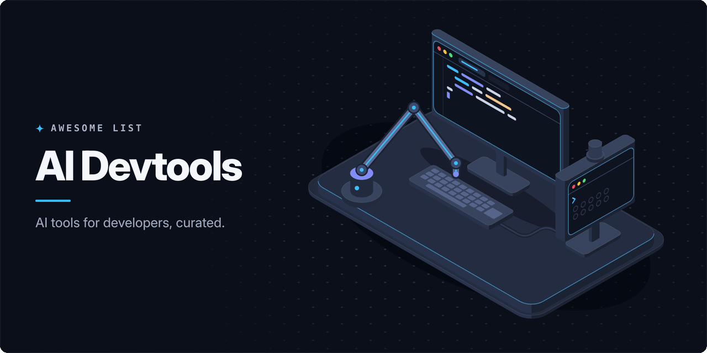

<!-- awesome:hero --><!-- /awesome:hero -->

<!-- awesome:title --><h1 align="center">Awesome AI Devtools</h1><!-- /awesome:title -->

<!-- awesome:tagline -->AI tools for working developers: coding agents, AI editors, terminal agents, code completion, testing, debugging, docs and code search.<!-- /awesome:tagline -->

<!-- awesome:badges -->

  
  
  

<!-- /awesome:badges -->

AI devtools are the agents, editors and assistants that help a developer write, read, test and ship code. This list covers terminal and cloud coding agents, AI editors and extensions, code review, testing, code context tools, agent workspaces, and the guides and benchmarks around them.

## Contents

- [Terminal agents](#terminal-agents)
  - [Coding agents](#coding-agents)
  - [Shell and git helpers](#shell-and-git-helpers)
- [AI editors](#ai-editors)
- [Editor extensions](#editor-extensions)
  - [VS Code and JetBrains](#vs-code-and-jetbrains)
  - [Vim, Neovim and Emacs](#vim-neovim-and-emacs)
- [Cloud and CI agents](#cloud-and-ci-agents)
  - [Cloud agents](#cloud-agents)
  - [In GitHub Actions](#in-github-actions)
- [Code review](#code-review)
- [Testing and debugging](#testing-and-debugging)
- [Docs and code context](#docs-and-code-context)
  - [Codebase search and packing](#codebase-search-and-packing)
  - [Library docs for agents](#library-docs-for-agents)
  - [Generated docs](#generated-docs)
- [Agent workspaces and add-ons](#agent-workspaces-and-add-ons)
  - [Parallel agent workspaces](#parallel-agent-workspaces)
  - [Specs, rules and protocols](#specs-rules-and-protocols)
  - [Add-ons](#add-ons)
- [Guides and benchmarks](#guides-and-benchmarks)
- [Related lists](#related-lists)
- [Contributing](#contributing)

## Terminal agents

### Coding agents

- [Aider](https://github.com/Aider-AI/aider) - Pair-programming CLI that edits files in your git repo and commits each change.
- [Amp](https://ampcode.com) - Coding agent for the terminal and editors, with threads shared across a team.
- [Auggie CLI](https://github.com/augmentcode/auggie) - Augment Code's terminal agent, backed by its codebase context engine.
- [Claude Code](https://github.com/anthropics/claude-code) - Anthropic's coding agent that reads, edits and runs code from the terminal.
- [Codex CLI](https://github.com/openai/codex) - OpenAI's open-source coding agent that runs locally in your terminal.
- [Crush](https://github.com/charmbracelet/crush) - Terminal coding agent from Charm with multi-model support, LSP context and MCP.
- [Cursor CLI](https://cursor.com/cli) - Cursor's agent in the terminal, for interactive use, scripts and CI.
- [Gemini CLI](https://github.com/google-gemini/gemini-cli) - Google's open-source terminal agent for Gemini models, with MCP and shell tools.
- [GitHub Copilot CLI](https://github.com/github/copilot-cli) - Copilot's coding agent in the terminal, with GitHub issues and pull requests in reach.
- [Goose](https://github.com/aaif-goose/goose) - Open-source local agent, started at Block, that builds, runs and tests code through MCP.
- [gptme](https://github.com/gptme/gptme) - Provider-agnostic terminal agent with shell, Python, browser and file tools.
- [Kimi Code CLI](https://github.com/MoonshotAI/kimi-code) - Moonshot AI's terminal coding agent for its Kimi models.
- [Kiro CLI](https://kiro.dev/cli/) - Terminal agent from Kiro that replaced the Amazon Q Developer CLI.
- [mini-swe-agent](https://github.com/SWE-agent/mini-swe-agent) - Agent of about 100 lines that solves GitHub issues using only bash.
- [Mistral Vibe](https://github.com/mistralai/mistral-vibe) - Minimal terminal coding agent from Mistral AI.
- [Open Interpreter](https://github.com/openinterpreter/openinterpreter) - Terminal coding agent tuned for open models such as Kimi and GLM.
- [opencode](https://github.com/anomalyco/opencode) - Open-source terminal coding agent that works with many model providers.
- [Pi](https://github.com/earendil-works/pi) - Minimal agent harness you extend with TypeScript extensions, skills and prompt templates.
- [Qwen Code](https://github.com/QwenLM/qwen-code) - Terminal coding agent from the Qwen team, adapted from Gemini CLI.

### Shell and git helpers

- [aicommits](https://github.com/Nutlope/aicommits) - CLI that writes git commit messages from your staged changes.
- [LLM](https://github.com/simonw/llm) - CLI and Python library for prompting many models, with plugins and a logged history.
- [Lumen](https://github.com/jnsahaj/lumen) - Git diff viewer that also writes commit messages and summarizes changes with AI.
- [OpenCommit](https://github.com/di-sukharev/opencommit) - Writes commit messages with an LLM, as a CLI or a git hook.
- [Shell GPT](https://github.com/TheR1D/shell_gpt) - Turns plain requests into shell commands and answers questions in the terminal.

## AI editors

- [Cursor](https://cursor.com) - VS Code-based editor with an agent, tab completion and chat over your codebase.
- [Devin Desktop](https://devin.ai/desktop) - Cognition's editor, formerly Windsurf, for running and reviewing local and cloud agents.
- [Google Antigravity](https://antigravity.google) - Agent-first IDE from Google where agents plan, code and test in the editor and browser.
- [Kiro](https://kiro.dev) - Agentic IDE that turns prompts into specs, designs and tasks before it writes code.
- [Qoder](https://qoder.com) - Agentic IDE with codebase-aware chat, completion and long-running tasks.
- [Theia IDE](https://theia-ide.org) - Open-source IDE for desktop and browser with built-in AI chat, completion and agents.
- [Trae](https://www.trae.ai) - AI IDE from ByteDance with chat, completion and agent modes.
- [Warp](https://github.com/warpdotdev/warp) - Terminal-based development environment with built-in coding agents.
- [Zed](https://github.com/zed-industries/zed) - Fast open-source editor in Rust with an agent panel and support for outside agents.

## Editor extensions

### VS Code and JetBrains

- [Augment Code](https://www.augmentcode.com) - Coding agents for VS Code, JetBrains and the terminal, backed by a codebase context engine.
- [Cline](https://github.com/cline/cline) - Open-source agent for VS Code that edits files and runs commands with your approval.
- [Gemini Code Assist](https://codeassist.google) - Google's assistant for VS Code and JetBrains with chat, completion and an agent mode.
- [GitHub Copilot](https://github.com/features/copilot) - GitHub's assistant with completion, chat and an agent mode across the major editors.
- [JetBrains AI Assistant](https://www.jetbrains.com/ai/) - Chat, completion and refactoring built into JetBrains IDEs.
- [Junie](https://junie.jetbrains.com) - JetBrains coding agent that works in the IDE, the terminal and CI.
- [Kilo Code](https://github.com/Kilo-Org/kilocode) - Open-source agent for VS Code and JetBrains with plan, code and debug modes, plus a CLI.
- [llama.vscode](https://github.com/ggml-org/llama.vscode) - VS Code extension for local code completion and chat through a llama.cpp server.
- [Tabby](https://github.com/TabbyML/tabby) - Self-hosted assistant server with code completion and chat for many editors.
- [Tabnine](https://docs.tabnine.com/main) - Completion and chat assistant that can run in private or air-gapped deployments.
- [twinny](https://github.com/twinnydotdev/twinny) - VS Code assistant for completion, chat and edits against a model server you choose.

### Vim, Neovim and Emacs

- [aidermacs](https://github.com/MatthewZMD/aidermacs) - Runs Aider inside Emacs with diff review and per-project sessions.
- [avante.nvim](https://github.com/avante-corp/avante.nvim) - Neovim plugin for Cursor-style chat and code edits applied as diffs.
- [claudecode.nvim](https://github.com/coder/claudecode.nvim) - Neovim integration for Claude Code over the same protocol as its VS Code extension.
- [CodeCompanion.nvim](https://github.com/olimorris/codecompanion.nvim) - Neovim plugin for chat, inline edits and agents with many LLM providers.
- [copilot.lua](https://github.com/zbirenbaum/copilot.lua) - Lua rewrite of the Copilot plugin for Neovim, with an API for other plugins.
- [copilot.vim](https://github.com/github/copilot.vim) - GitHub's official Copilot plugin for Vim and Neovim.
- [gptel](https://github.com/karthink/gptel) - Simple LLM client for Emacs that works in any buffer with many backends.
- [llama.vim](https://github.com/ggml-org/llama.vim) - Vim plugin for local fill-in-the-middle completion through a llama.cpp server.
- [llm.nvim](https://github.com/huggingface/llm.nvim) - Hugging Face plugin for ghost-text code completion in Neovim from several backends.
- [Minuet](https://github.com/milanglacier/minuet-ai.nvim) - As-you-type code completion in Neovim from popular LLM providers.
- [opencode.nvim](https://github.com/sudo-tee/opencode.nvim) - Neovim frontend for the opencode agent.

## Cloud and CI agents

### Cloud agents

- [Claude Code on the web](https://code.claude.com/docs/en/claude-code-on-the-web) - Runs Claude Code tasks on Anthropic's cloud from the browser or the phone app.
- [Codex Cloud](https://learn.chatgpt.com/docs/cloud) - Runs Codex tasks in cloud sandboxes and returns diffs or pull requests.
- [Cursor Cloud Agents](https://cursor.com/docs/cloud-agent) - Cursor agents that work in remote environments and open pull requests.
- [Devin](https://devin.ai) - Cognition's autonomous engineer that plans, codes and tests in its own cloud workspace.
- [Ellipsis](https://www.ellipsis.dev) - Managed Claude Code agents in the cloud, defined as config files in your repo.
- [Factory](https://factory.com) - Droid agents for coding, testing and migrations across IDE, terminal, Slack and CI.
- [GitHub Copilot cloud agent](https://docs.github.com/en/copilot/concepts/agents/cloud-agent/about-cloud-agent) - Copilot agent that works on assigned issues in GitHub Actions and opens a pull request.
- [Jules](https://jules.google) - Google's asynchronous agent that works on GitHub repos in a cloud VM.
- [Open SWE](https://github.com/langchain-ai/open-swe) - Open-source asynchronous coding agent from LangChain, built on LangGraph.
- [OpenHands](https://github.com/OpenHands/OpenHands) - Open-source platform for software agents that run in sandboxes, locally or in the cloud.
- [SWE-agent](https://github.com/SWE-agent/SWE-agent) - Research agent that takes a GitHub issue and tries to fix it with your model of choice.

### In GitHub Actions

- [Claude Code Action](https://github.com/anthropics/claude-code-action) - GitHub Action that runs Claude Code on pull requests and issues when mentioned.
- [Codex Action](https://github.com/openai/codex-action) - GitHub Action that runs Codex inside CI workflows.
- [GitHub Agentic Workflows](https://github.com/github/gh-aw) - Repository automations written in markdown that coding agents run in GitHub Actions.
- [Run Gemini CLI](https://github.com/google-github-actions/run-gemini-cli) - GitHub Action that runs Gemini CLI for reviews, triage and code changes.

## Code review

- [CodeRabbit](https://www.coderabbit.ai) - Reviews pull requests with summaries and line comments, with IDE and CLI reviewers too.
- [cubic](https://www.cubic.dev) - Reviewer for GitHub pull requests aimed at large, complex codebases.
- [Cursor Bugbot](https://cursor.com/bugbot) - Reviews pull requests for bugs and hands each finding back to Cursor to fix.
- [GitHub Copilot code review](https://docs.github.com/en/copilot/concepts/agents/code-review) - Copilot reviewer you request on a pull request like a teammate.
- [Gito](https://github.com/Nayjest/Gito) - Open-source reviewer that runs with any model, locally or in GitHub Actions.
- [Graphite](https://graphite.com) - Stacked pull request workflow for GitHub with an AI reviewer.
- [Greptile](https://www.greptile.com) - Reviews pull requests on GitHub and GitLab with context from the whole codebase.
- [hunk](https://github.com/modem-dev/hunk) - Terminal diff viewer for reviewing agent-written changes with inline annotations.
- [Kodus](https://github.com/kodustech/kodus-ai) - Self-hostable reviewer for GitHub, GitLab, Bitbucket and Azure DevOps with any model.
- [Macroscope](https://macroscope.com) - Reviews GitHub pull requests using a graph of your code, and writes status updates.
- [PR-Agent](https://github.com/The-PR-Agent/pr-agent) - Open-source pull request reviewer with commands to describe, review and improve.
- [Qodo](https://www.qodo.ai) - Review agents for the IDE and pull requests, with test generation and team rules.
- [Sourcery](https://github.com/sourcery-ai/sourcery) - Reviews pull requests with a summary, high-level feedback and line comments.

## Testing and debugging

- [Checksum](https://checksum.ai) - Generates and maintains Playwright end-to-end tests in your repository.
- [Chrome DevTools MCP](https://github.com/ChromeDevTools/chrome-devtools-mcp) - Gives coding agents Chrome DevTools for debugging, network checks and performance traces.
- [Codeflash](https://github.com/codeflash-ai/codeflash) - Finds faster versions of Python code and checks that they behave the same.
- [Diffblue Cover](https://www.diffblue.com) - Writes and maintains Java unit tests without manual input.
- [Keploy](https://github.com/keploy/keploy) - Records API traffic and turns it into tests and data mocks.
- [Meticulous](https://www.meticulous.ai) - Generates and maintains frontend tests from recorded app sessions.
- [Momentic](https://momentic.ai) - Plain-English end-to-end tests that an AI agent runs and maintains.
- [Playwright MCP](https://github.com/microsoft/playwright-mcp) - MCP server that lets agents drive a browser through Playwright's accessibility tree.
- [Playwright Test Agents](https://playwright.dev/docs/test-agents) - Planner, generator and healer agents that write and repair Playwright tests.
- [QA Wolf](https://www.qawolf.com) - Testing service that builds and maintains end-to-end suites with AI agents.
- [Sentry Seer](https://sentry.io/product/seer/) - Sentry's debugging agent that finds the root cause of errors and proposes fixes.
- [Shortest](https://github.com/antiwork/shortest) - End-to-end tests written in natural language and run with Playwright.
- [TestDriver](https://github.com/testdriverai/testdriverai) - Computer-use SDK for end-to-end QA tests that need no selectors.

## Docs and code context

### Codebase search and packing

- [Claude Context](https://github.com/zilliztech/claude-context) - MCP server for semantic code search across a whole codebase.
- [code2prompt](https://github.com/mufeedvh/code2prompt) - CLI that turns a codebase into one LLM prompt with a source tree and templates.
- [gitingest](https://github.com/coderamp-labs/gitingest) - Turns any Git repository into a prompt-friendly text digest.
- [Repomix](https://github.com/yamadashy/repomix) - Packs a repository into one AI-friendly file, with token counts.
- [Serena](https://github.com/oraios/serena) - MCP toolkit that gives agents semantic code retrieval and editing through language servers.
- [Sourcebot](https://github.com/sourcebot-dev/sourcebot) - Self-hosted code search with an agent that answers questions about your code.
- [Sourcegraph Deep Search](https://sourcegraph.com/deep-search) - Agent that searches across your codebase to answer questions about it.

### Library docs for agents

- [Context7](https://github.com/upstash/context7) - MCP server and API with current, version-specific library docs for coding agents.
- [GitMCP](https://github.com/idosal/git-mcp) - Remote MCP server that serves the docs and code of any GitHub project.
- [Ref](https://ref.tools) - MCP server that searches public and private docs for agents using few tokens.

### Generated docs

- [DeepWiki](https://deepwiki.com) - Cognition's site of AI-generated wikis for public GitHub repositories.
- [DeepWiki-Open](https://github.com/AsyncFuncAI/deepwiki-open) - Self-hosted generator of wikis and diagrams for GitHub, GitLab and Bitbucket repos.
- [Google Code Wiki](https://codewiki.google) - Generated documentation for code repositories that updates as the code changes.
- [Mintlify](https://www.mintlify.com) - Docs platform with an agent that drafts and updates documentation.
- [readme-ai](https://github.com/eli64s/readme-ai) - Generates README files from a repository with an LLM.

## Agent workspaces and add-ons

### Parallel agent workspaces

- [Claude Squad](https://github.com/smtg-ai/claude-squad) - Terminal app that runs several coding agents in separate tmux sessions and worktrees.
- [CloudCLI](https://github.com/siteboon/claudecodeui) - Web and mobile UI for Claude Code, Codex, Cursor CLI and opencode sessions.
- [cmux](https://github.com/manaflow-ai/cmux) - Ghostty-based macOS terminal with vertical tabs and notifications for coding agents.
- [Conductor](https://conductor.build) - Mac app that runs Claude Code and Codex agents in parallel git worktrees.
- [Container Use](https://github.com/dagger/container-use) - Gives each coding agent its own container and git branch to work in.
- [Nimbalyst](https://github.com/nimbalyst/nimbalyst) - Visual workspace that runs coding agents in worktrees, with diff review and a kanban.
- [opcode](https://github.com/winfunc/opcode) - Desktop GUI for Claude Code sessions, custom agents and usage tracking.
- [Sculptor](https://github.com/imbue-ai/sculptor) - Desktop app from Imbue that runs coding agents in parallel.
- [Superset](https://github.com/superset-sh/superset) - Workspace that runs CLI agents with terminals, code review and browser previews.
- [Vibe Kanban](https://github.com/BloopAI/vibe-kanban) - Kanban board that hands tasks to coding agents and collects their work for review.

### Specs, rules and protocols

- [Agent Client Protocol](https://agentclientprotocol.com) - Open protocol that connects any editor to any coding agent.
- [Agent Skills](https://agentskills.io) - Open format for packaging instructions and scripts that agents load when needed.
- [AGENTS.md](https://agents.md) - Open format for a README that tells coding agents how to work in a repository.
- [Beads](https://github.com/gastownhall/beads) - Dependency-aware issue tracker that gives coding agents memory across long tasks.
- [BMAD Method](https://github.com/bmad-code-org/BMAD-METHOD) - Agile method with role-based agents for planning and building software with AI.
- [OpenSpec](https://github.com/Fission-AI/OpenSpec) - Spec-driven workflow where you and the agent agree on a spec before any code.
- [Ruler](https://github.com/intellectronica/ruler) - Applies one set of rules to every coding agent's config files.
- [Spec Kit](https://github.com/github/spec-kit) - GitHub's toolkit for spec-driven development with coding agents.
- [Task Master](https://github.com/eyaltoledano/claude-task-master) - Task manager that breaks a product spec into tasks for AI editors and agents.

### Add-ons

- [Agents](https://github.com/wshobson/agents) - Plugins, subagents and skills shared across Claude Code, Codex, Cursor and more.
- [ccusage](https://github.com/ccusage/ccusage) - Reports token use and cost from the local logs of Claude Code and other agents.
- [Claude Code Router](https://github.com/musistudio/claude-code-router) - Routes Claude Code requests to other models and providers.
- [GitHub MCP Server](https://github.com/github/github-mcp-server) - GitHub's MCP server that lets agents read and act on repos, issues and pull requests.
- [Superpowers](https://github.com/obra/superpowers) - Skills library that teaches coding agents to brainstorm, plan and test before they code.

## Guides and benchmarks

- [Aider LLM leaderboards](https://aider.chat/docs/leaderboards/) - Aider's benchmark of how well models edit code across many languages.
- [Best practices for Claude Code](https://code.claude.com/docs/en/best-practices) - Anthropic's guide to setup, prompting and workflows with Claude Code.
- [Exploring Generative AI](https://martinfowler.com/articles/exploring-gen-ai.html) - Thoughtworks memo series on using AI coding assistants in delivery work.
- [Here's how I use LLMs to help me write code](https://simonwillison.net/2025/Mar/11/using-llms-for-code/) - Simon Willison's practical habits for coding with LLMs.
- [How to write a great AGENTS.md](https://github.blog/ai-and-ml/github-copilot/how-to-write-a-great-agents-md-lessons-from-over-2500-repositories/) - GitHub's lessons from the agent files of over 2,500 repositories.
- [SWE-bench](https://github.com/SWE-bench/SWE-bench) - Benchmark of real GitHub issues that a model must resolve with a patch.
- [SWE-Bench Pro](https://github.com/scaleapi/SWE-bench_Pro-os) - Scale AI's harder benchmark of long-horizon software engineering tasks.
- [Terminal-Bench](https://www.tbench.ai) - Benchmark of hard tasks that agents must finish in a terminal.

## Related lists

- [Awesome AI Devtools (jamesmurdza)](https://github.com/jamesmurdza/awesome-ai-devtools) - Large list of AI-powered developer tools.
- [Awesome Claude Code](https://github.com/hesreallyhim/awesome-claude-code) - Commands, hooks, skills and tools for Claude Code.
- [Awesome CLI Coding Agents](https://github.com/bradAGI/awesome-cli-coding-agents) - Directory of terminal coding agents and the harnesses around them.
- [Awesome Copilot](https://github.com/github/awesome-copilot) - GitHub's collection of instructions, agents and skills for Copilot.
- [Awesome Cursor Rules](https://github.com/PatrickJS/awesome-cursorrules) - Collection of rule files for the Cursor editor.

## Contributing

Contributions are welcome. Read the [contribution guidelines](contributing.md) first.

<!-- awesome:maintainer -->
Maintained by [Ian Wiedenman](https://github.com/ianwieds).
<!-- /awesome:maintainer -->
